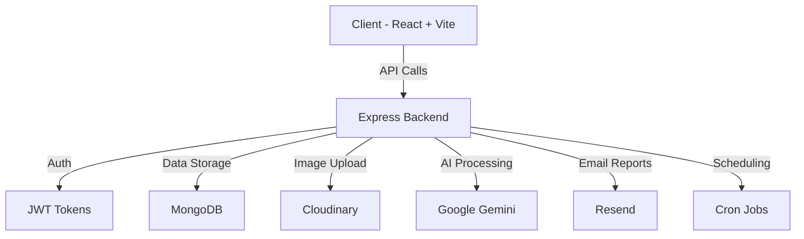

<div align="center">

# 💰 FinAIlytics [](https://youtu.be/07ExXWEKaH4)

### AI-Powered Personal Finance Management Platform

[](https://www.typescriptlang.org/)
[](https://reactjs.org/)
[](https://nodejs.org/)
[](https://www.mongodb.com/)
[](https://expressjs.com/)
[](https://tailwindcss.com/)

**AI-powered personal finance web app to track income/expenses, scan receipts with AI, import CSV transactions, and visualize insights with beautiful analytics.**

[Features](#-key-features) • [Tech Stack](#-tech-stack) • [Setup](#-end-to-end-setup) • [Usage](#-usage-guide) • [Architecture](#-architecture-overview)

</div>

---

## 🚀 Key Features

<table>
<tr>
<td width="50%">

### 🔐 **Authentication & Security**
- Email + Password authentication
- JWT-based secure sessions
- Access & refresh token handling

### 💳 **Transaction Management**
- Create, edit, duplicate & delete
- Bulk CSV import (up to 300 transactions)
- Recurring transaction support
- Advanced filtering & search

</td>
<td width="50%">

### 🤖 **AI-Powered Receipt Scanning**
- Upload receipt image
- Auto-extract transaction details
- Powered by Google Gemini AI
- Cloudinary image storage

### 📊 **Advanced Analytics**
- Real-time financial summaries
- Income vs Expense charts
- Category breakdown pie charts
- Custom date range presets
- Savings rate calculation

</td>
</tr>
</table>

### ⚡ **Additional Features**
- 📧 Monthly email reports via Resend
- 🔄 Automated recurring transactions (cron-enabled)
- 🌓 Dark/Light theme support
- 📱 Responsive design

---

## 🛠️ Tech Stack

### **Frontend**
<p>


</p>

### **Backend**
<p>


</p>

### **AI & Cloud Services**
<p>


</p>

---

## 📁 Architecture Overview



### **Frontend Architecture**
- **React 18** with Vite for blazing-fast development
- **Redux Toolkit Query** for state management & API caching
- **TailwindCSS + shadcn/radix** for modern, accessible UI
- JWT authentication with automatic token refresh
- Features: CRUD operations, bulk import, AI scan, analytics

### **Backend Architecture**
- **Express + TypeScript** for type-safe API development
- **MongoDB + Mongoose** for flexible data modeling
- JWT-based authentication (access + refresh tokens)
- **Cloudinary** integration for receipt image storage
- **Google Gemini AI** for intelligent receipt parsing
- **Resend** for automated email reports
- Cron jobs for recurring transactions and monthly reports
- All routes mounted under `BASE_PATH` (default `/api`)

---

## 📂 Project Structure

```
root
├─ 🔧 backend/
│  ├─ src/
│  │  ├─ 🎮 controllers/        # Route handlers
│  │  ├─ ⚙️ services/           # Business logic (auth, analytics, transactions)
│  │  ├─ 📊 models/             # Mongoose schemas
│  │  ├─ 🛣️ routes/             # Express routers
│  │  ├─ ⚙️ config/             # Environment, DB, Cloudinary, AI, Passport, CORS
│  │  ├─ 🛠️ utils/              # Helper functions
│  │  ├─ 🔒 middlewares/        # Auth & validation
│  │  └─ index.ts            # Application entry point
│  └─ package.json
│
└─ 💻 client/
   ├─ src/
   │  ├─ 🏪 app/                # RTK store and API client
   │  ├─ ✨ features/           # RTK Query endpoints and types
   │  ├─ 🎨 components/         # Reusable UI components
   │  ├─ 📄 pages/              # Route pages (dashboard, transactions, settings)
   │  ├─ 🎭 layouts/            # Base/app layouts
   │  ├─ 🛣️ routes/             # Route configurations
   │  ├─ 📚 lib/                # Helper functions (formatting, etc.)
   │  └─ 📋 constant/           # Enums and constants
   └─ package.json
```

---

## 🚀 End-to-End Setup

### 📋 Prerequisites

Before you begin, ensure you have the following installed:

-  **Node.js 18+**
-  **MongoDB** (local or cloud)
-  **Cloudinary account** (for receipt images)
-  **Google Gemini API key**
-  **Resend API key** (optional in dev)

---

### ⚙️ Backend Setup

1️⃣ **Navigate to backend directory and install dependencies:**
```bash
cd backend
npm install
```

2️⃣ **Create `.env` file** (see [Example .env Files](#-example-env-files) below)

3️⃣ **Start development server:**
```bash
npm run dev
```

4️⃣ **Expected output:**
```
✅ Server is running on port 8000 in development mode
```

Routes will be available at: `http://localhost:8000/api/*`

---

### 💻 Frontend Setup

1️⃣ **Navigate to client directory and install dependencies:**
```bash
cd client
npm install
```

2️⃣ **Create `.env` file** (see [Example .env Files](#-example-env-files) below)

3️⃣ **Start development server:**
```bash
npm run dev
```

4️⃣ **Open your browser:**
```
🌐 http://localhost:5173
```

---

## 📖 Usage Guide

### 🔐 Authentication

- **Sign up** and **sign in** with email/password
- Tokens handled automatically via RTK Query
- Refresh tokens managed with `credentials: "include"`

---

### 💳 Add Transactions

Create transactions with the following details:
- Title, type (income/expense), amount
- Category, date, payment method
- Supports **duplicate**, **update**, and **delete** operations

---

### 🤖 AI Receipt Scan

**Endpoint:** `POST /api/transaction/scan-receipt`

**How it works:**

1. Upload receipt image (JPEG/PNG, max 2MB)
2. Backend uploads to **Cloudinary**
3. Image processed by **Google Gemini AI**
4. Automatically extracts:
   - `title`, `amount`, `date`
   - `description`, `category`
   - `paymentMethod`, `type`, `receiptUrl`
5. Review and save as transaction

---

### 📊 Bulk Import via CSV

**Endpoint:** `POST /api/transaction/bulk-transaction`

The client parses CSV and sends JSON:

```json
{
  "transactions": [
    {
      "title": "Coffee",
      "type": "EXPENSE",
      "amount": 4.50,
      "category": "dining",
      "description": "",
      "date": "2025-11-10",
      "paymentMethod": "CASH",
      "isRecurring": false,
      "recurringInterval": null
    }
  ]
}
```

**Transaction Types:** `INCOME` | `EXPENSE`

**Payment Methods:** `CARD` | `BANK_TRANSFER` | `MOBILE_PAYMENT` | `AUTO_DEBIT` | `CASH` | `OTHER`

**Recurring Intervals:** `DAILY` | `WEEKLY` | `MONTHLY` | `YEARLY` | `null`

**Limits:** Up to **300 transactions** per request

---

### 📈 Analytics

**Real-time financial insights:**

- 💰 **Summary Dashboard**
  - Available Balance
  - Total Income
  - Total Expenses
  - Savings Rate (clamped: −100% to 100%)
    - ❌ Negative = Overspending (Red)
    - ✅ Positive = Healthy Savings (Green)

- 📊 **Visualizations**
  - Income vs Expenses over time
  - Expense breakdown pie chart
  - Custom date range presets

---

## 📜 Scripts

### Backend Commands
```bash
npm run dev      # Start development server with ts-node-dev
npm run build    # Compile TypeScript
npm start        # Run compiled production server
```

### Client Commands
```bash
npm run dev      # Start Vite dev server
npm run build    # Build for production
npm run preview  # Preview production build
```

---

## 🔧 Example .env Files

### `backend/.env`
```env
NODE_ENV=development
PORT=8000
BASE_PATH=/api

# MongoDB
MONGO_URI=mongodb://localhost:27017/finailytics

# JWT Secrets
JWT_SECRET=your_jwt_secret
JWT_EXPIRES_IN=15m
JWT_REFRESH_SECRET=your_jwt_refresh_secret
JWT_REFRESH_EXPIRES_IN=7d

# AI (Google Gemini)
GEMINI_API_KEY=your_gemini_api_key

# Cloudinary
CLOUDINARY_CLOUD_NAME=your_cloud_name
CLOUDINARY_API_KEY=your_cloudinary_api_key
CLOUDINARY_API_SECRET=your_cloudinary_api_secret

# Email (Resend)
RESEND_API_KEY=your_resend_api_key
RESEND_MAILER_SENDER=no-reply@yourdomain.com

# CORS
FRONTEND_ORIGIN=http://localhost:5173
```

### `client/.env`
```env
# Must include /api if backend uses BASE_PATH=/api
VITE_API_URL=http://localhost:8000/api
```

---

## 🐛 Troubleshooting

<details>
<summary><b>❌ 404 Error on auth/register from localhost:5173</b></summary>

**Solution:**
- Ensure `client/.env` has: `VITE_API_URL=http://localhost:8000/api`
- Restart Vite after changing environment variables
</details>

<details>
<summary><b>❌ 500: "Transaction numbers are only allowed on a replica set member"</b></summary>

**Cause:** Occurs on MongoDB standalone during transactions

**Solution:** Backend automatically falls back to non-transactional writes for signup
</details>

<details>
<summary><b>❌ Login says "Email/password not found"</b></summary>

**Solution:**
- Email lookups are normalized to lowercase
- Ensure you signed up first with the exact same email
</details>

<details>
<summary><b>📊 Savings rate shows unrealistic values</b></summary>

**Note:** Values are clamped (−100% to 100%) for display realism
- Negative values indicate overspending
</details>

---

## 🔒 Security Notes

> **⚠️ Important Security Guidelines:**

- ❌ **Never commit** real API keys or secrets to version control
- ✅ Use `.env` files and add them to `.gitignore`
- 🔐 In production:
  - Use **HTTPS** for all communications
  - Enable **secure cookies**
  - Configure proper **CORS** settings
  - Use hardened **JWT** settings
  - Implement rate limiting
  - Use environment-specific secrets

---

## 📄 License

Personal usage permitted. For commercial usage, follow the original project's license terms.

---

<div align="center">

### 🌟 If you find this project useful, please give it a star!

**Made with 💻 and ☕**

</div>
